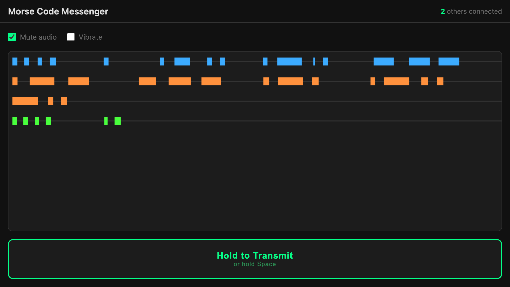

# Morse Code Messenger

A real-time web app where anyone on the page can hold a button to transmit a signal. Every connected device hears a beep and/or vibration simultaneously, and all signals are drawn as a live timeline on a shared canvas.



## How it works

Hold the **Hold to Transmit** button (or hold **Space** on desktop) to send a signal. Release to stop. Everyone connected sees and hears the transmission in real time.

- Each user gets a visually distinct color, chosen to be as different as possible from existing users.
- Signals appear as horizontal bars on the canvas — one row per user, wrapping to a new line for each new transmission.
- Audio plays a 600 Hz sine tone. Vibration is supported on Android.
- Mute and vibration toggles are available in Settings.

## Stack

- **Frontend**: Vanilla JS, Web Audio API, Canvas 2D, Pointer Events, WebSockets
- **Backend**: Node.js with the `ws` library — serves static files and handles WebSocket connections on the same port
- **Hosting**: Static files on a web host (e.g. DreamHost); WebSocket server on a platform that supports persistent connections (e.g. Render, Oracle Cloud)

## Running locally

```bash
npm install
npm start
```

Then open `http://localhost:8080`, or from other devices on the same network open http://{host IP address}:8080. Open multiple tabs or devices on the same network to test multi-user behavior.

## Known issues

- **Chrome on iOS**: Audio does not work. iOS requires all browsers to use Safari's WebKit engine, and Chrome on iOS does not grant AudioContext permission the same way Safari does. Use Safari on iPhone/iPad.
- **iOS**: Tapping fast often opens a little magnifying bubble that interrupts the sending.
- **Android**: Not yet tested.

## Deployment

The server (`server.js`) can be deployed to any Node.js host. Set the `PORT` environment variable if needed — it defaults to `8080`.

The frontend automatically uses `ws://` or `wss://` based on whether the page is served over HTTP or HTTPS, so no configuration is needed when moving between local and production environments.
